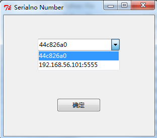
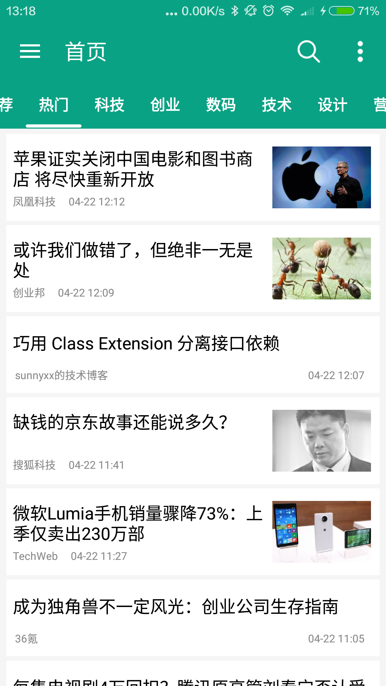
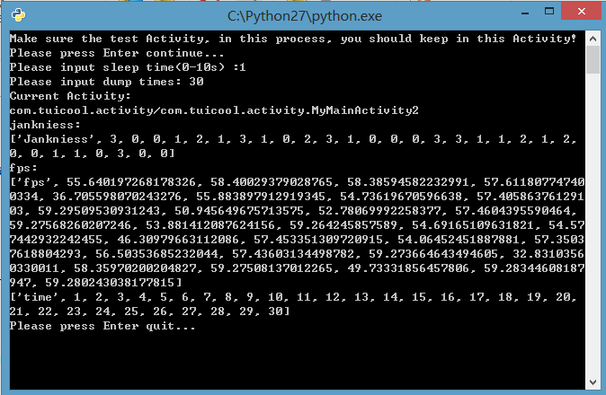
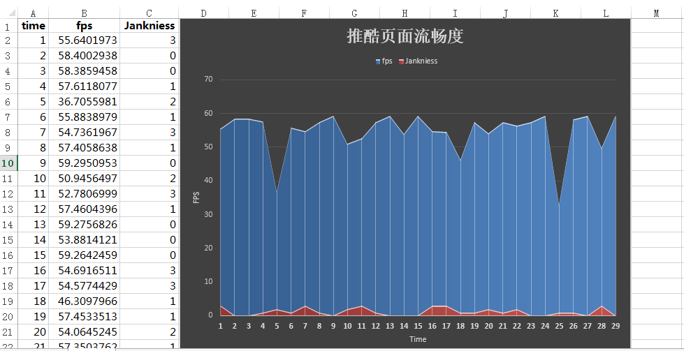
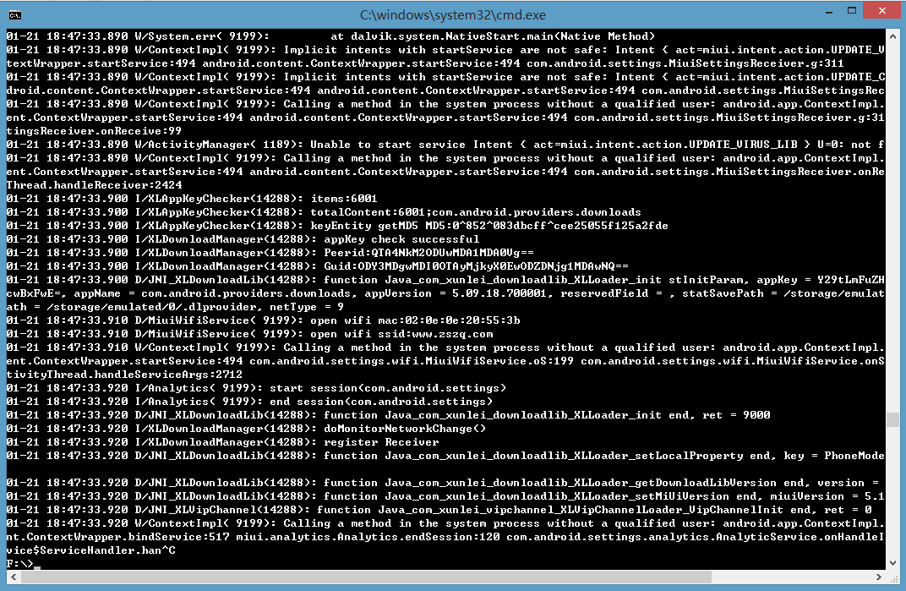
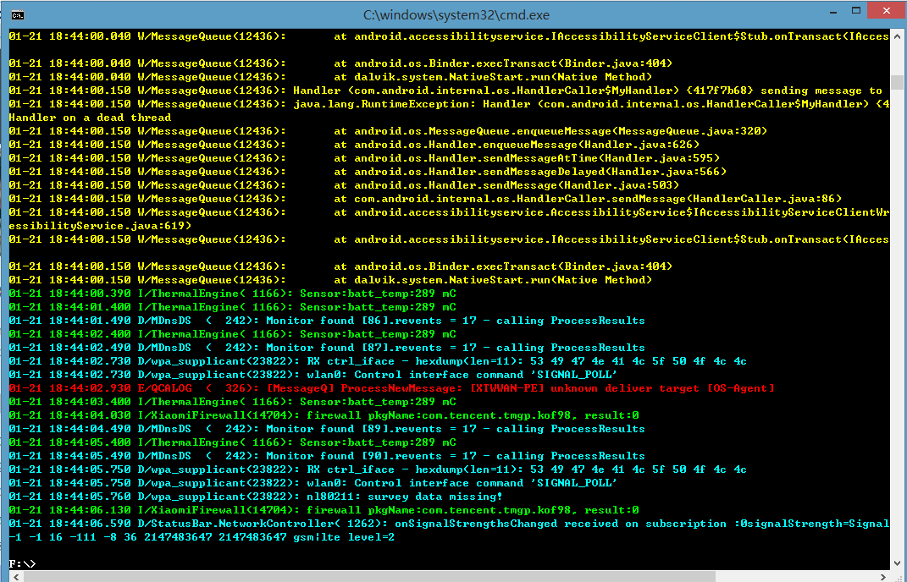

AndroidTestScripts
==================

Android测试中常用到的脚本

###主要脚本功能

批量安装应用（支持以中文命名的 apk）、批量卸载、截屏、录制视频、获取当前应用的 apk 文件、包名、Activity 名等。<br>


###2016.7.19
增加部分python脚本对多设备的支持：


###2016.04.22
增加 `fps.py`,获取测试界面的 `fps`、`jankniess`。

使用方法：按照提示输入参数，测试过程中操作界面，最终数据结果存放于 `fps_data` 目录下，csv 格式。
如有错误，请指出！

####demo：

测试界面：



cmd 界面：



最终结果：




###2016.01.21
增加 `logcat.py`，windows 中在 cmd 里面运行 logcat 命令，会给输出的日志内容根据优先级添加颜色。使用前提是已配置 adb 及 python 的环境变量，在 cmd 里面可以直接运行 adb 命令和python 脚本。
用法：
将`logcat.py` 配置到环境变量里面，使得可以在 cmd 中可以直接执行 logcat 命令。参数与 `adb logcat` 的一样。例如：
```
logcat -v time
```
无颜色时截图：


logcat 执行后：


当要使用重定向时，请使用 `adb logcat`.


###2015.06.02
增加 `get_app_crash_log.py`  与 `getAppCrashLog.sh`, 应用发生 crash ，未及时从 logcat 获取到有效 log 时，可通过该脚本获取 log

###2015.05.30
增加 `get_app_permission.py`，获取设备当前应用的权限详情，windows 下会将结果写入 `permission.txt` 文件中，其他系统打印在控制台：

```
[xuxu:...1/AndroidTestScripts/python]$ python get_app_permission.py                                          (master✱) 
package: com.android.camera

android.permission.READ_PHONE_STATE:
  允许应用程序访问设备的手机功能。有此权限的应用程序可确定此手机的号码和序列号，是否正在通话，以及对方的号码等。
android.permission.CAMERA:
  允许应用程序使用相机拍照，这样应用程序可随时收集进入相机镜头的图像。
android.permission.WRITE_EXTERNAL_STORAGE:
  允许应用程序写入SD卡。
android.permission.ACCESS_FINE_LOCATION:
  访问精准的位置源，例如手机上的全球定位系统(如果有)。恶意应用程序可能会借此确定您所处的位置，并可能消耗额外的电池电量。
android.permission.ACCESS_WIFI_STATE:
  允许应用程序查看有关 WLAN 状态的信息。
android.permission.ACCESS_NETWORK_STATE:
  允许应用程序查看所有网络的状态。
android.permission.WAKE_LOCK:
  允许应用程序防止手机进入休眠状态。
android.permission.RECORD_AUDIO:
  允许应用程序访问录音路径。
android.permission.MODIFY_AUDIO_SETTINGS:
  允许应用程序修改整个系统的音频设置，如音量和路由。
```

###2015.02.12
因日常工作需要，增加备份设备中安装的第三方应用的脚本 `backup_app.py`。（区别于adb backup命令，只备份apk）<br>

###2015.01.31
修改 `screenrecord.py` 中的默认录制时间，默认最长录制时间为 180 秒<br>

###2015.01.29
新增脚本 `get_cpu_mem_info.py`,获取设备当前运行的应用的 cpu、memory 信息，默认 top times 取值为20次，可自己修改脚本中的该参数

脚本运行需要安装pychartdir模块，安装方法请参考 [http://blog.csdn.net/gb112211/article/details/43272049](http://blog.csdn.net/gb112211/article/details/43272049 "python pychartdir模块的安装及使用")<br>
直接运行脚本，会生成线性图表存放于chart目录下，图表类似于：<br>


###2015.01.28
修改了设备状态判断的代码（脚本自己都曾使用OK,如有问题，可以QQ联系：274925460）<br>

###2015.01.26

1.	改写 python 分类中的脚本结构，将大部分方法分装进了 scriptUtils 包中的 utils 模块中<br>
2.	新增 `screenrecord.py`（录制视频,Android4.4新增功能）<br>
3.	使用时请直接在脚本目录下运行脚本（可以将脚本目录复制到桌面上，使用时很方便）<br>
4.	需要配置 `ANDROID_HOME`，如果脚本执行失败，请在命令行模式下运行脚本，查看报错信息<br>
